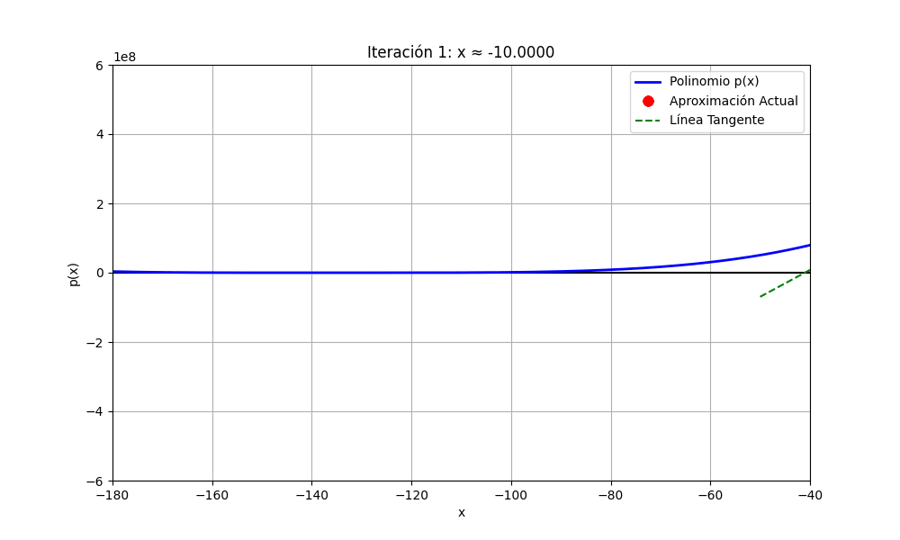

# TALLER 2
Hecho por Lady Velasquez

## EJERCICIO 1
Encuentre todas las raíces del polinomio:
$$x^4 + 540x^3 + 109124x^2 + 9781632x + 328188672 = 0$$
```
import numpy as np

coeficientes = [1, 540, 109124, 9781632, 328188672]
raices = np.roots(coeficientes)
print("Las raices del polinomio son: \n", raices)
```


## EJERCICIO 2
Encuentre todos los puntos en los que la curva $(\frac{y}{2})^2 = (\frac{x+3}{2})^2 - 1$ interseca el eje $y = -2$.

- Primero debemos simplificar la ecuación, reemplazando el valor de y = 2. De esta manera, obtenemos el polinomio a calcular. 
- El polinomio obtenido es: $$0 = x^2 + 6x + 1$$

```
import numpy as np

coeficientes = [1, 6, 1]
raices = np.roots(coeficientes)

print(f"Las raices del polinomio son: \n {raices}\n")
print(f"Los puntos de intersección de la curva son: \n ({raices[0]},-2) ({raices[1]}, -2) ")
```


## EJERCICIO 3
Dada la función $f(x) = \frac{\sin(x)}{x}$, ¿a partir de qué valor $x_T$ se cumple que $f(x) < 0.015, \forall x \geq x_T$?

```
alt_max = 0.015

x_T = 1 / alt_max

print(f"El valor a partir del cual |sin(x)/x| es siempre menor que {alt_max} es:")
print(f"x_T ≈ {round(x_T, 2)}")
```
